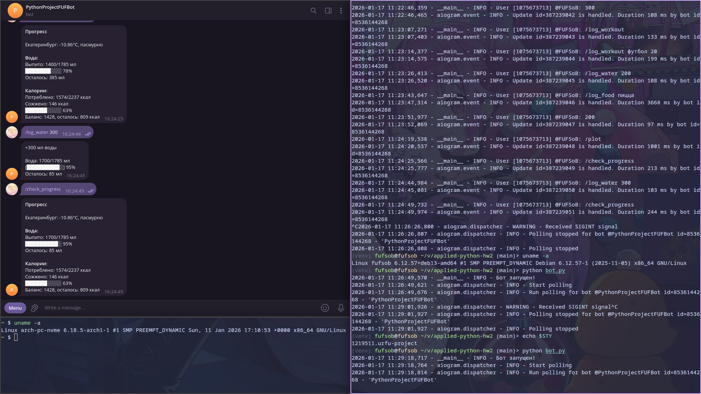

# applied-python-hw2

Коммит финальной версии проекта: f00a1b74c19c7dfbb1aa95cf0978e7178e9cc6c7

Проект хостится на своём сервере Debian.

Бот: https://t.me/PythonProjectFUFBot



## Запуск

```bash
cp .env.example .env
# Отредактируйте .env файл, указав токен бота Telegram и ключ API для OpenWeatherMap
pip install -r requirements.txt
python bot.py
```
